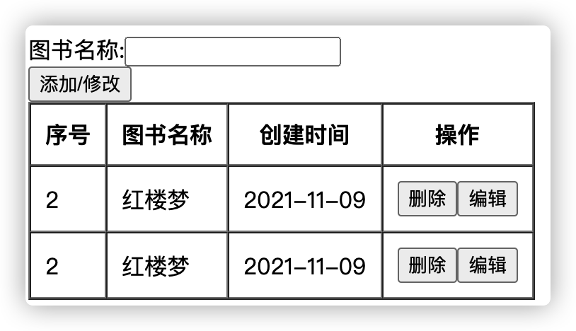

## 需求



+ tr每一行封装为组件
+ 数据展示通过接口获取数据进行展示
+ 点击添加/修改按钮
  + 添加：通过接口判断图书是否存在，如果存在按钮应该禁用，如果不存在可以点击添加进行添加
+ 点击编辑将当前图书名显示到图书名称输入框进行编辑
  + 编辑：通过接口判断图书是否存在，如果存在按钮应该禁用，如果不存在可以点击完成编辑
+ 点击删除发送请求进行数据删除
+ 如果只有一本图书，删除按钮应禁用


## 静态结构

```vue
<template>
  <div id="app">
    <div>
      <span>图书名称:</span>
      <input type="text" />
    </div>
    <div>
      <button >添加/修改</button>
    </div>
    <div>
      <table
        border="1"
        cellpadding="10"
        cellspacing="0"
      >
        <tr>
          <th>序号</th>
          <th>图书名称</th>
          <th>创建时间</th>
          <th>操作</th>
        </tr>
        <tr >
          <td></td>
          <td></td>
          <td></td>
          <td>
            <button >删除</button>
            <button >编辑</button>
          </td>
        </tr>
      </table>
    </div>
  </div>
</template>
<script>
export default {

}
</script>

```

