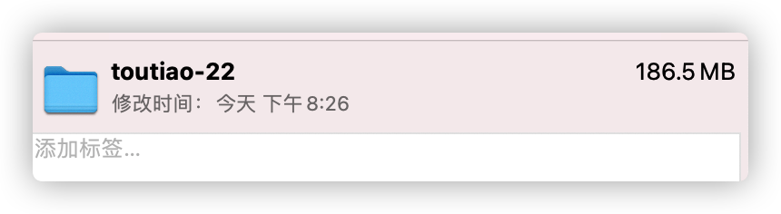
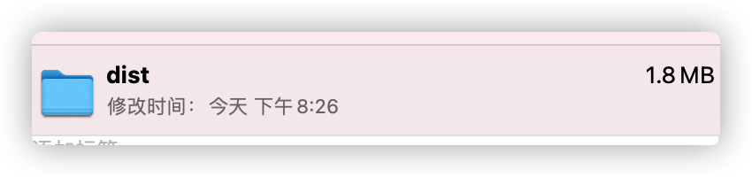
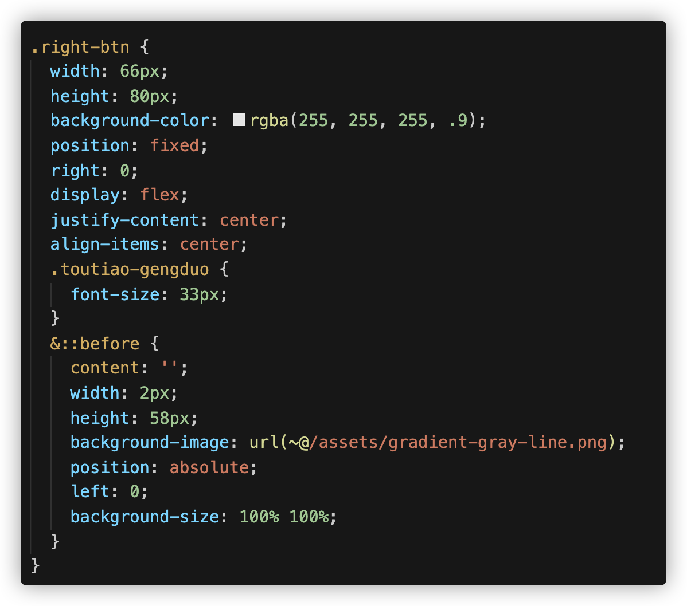
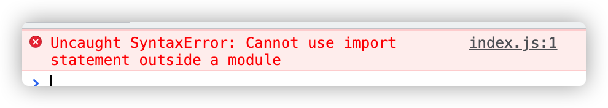
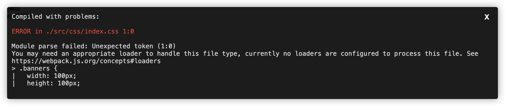

# Day01

## 今日学习目标

1. 能够理解webpack基本概念和作用

2. 能够掌握webpack使用步骤

3. 能够使用webpack相关配置

4. 能够使用webpack开发服务器

5. 能够查阅使用webpack中文文档

## 1. webpack基本概念

> 目标: webpack本身是, node的一个第三方模块包, 用于打包代码

[webpack官网](https://webpack.docschina.org/)

* 现代 javascript 应用程序的 **静态模块打包器 (module bundler)**

* 为要学的 vue-cli 开发环境做铺垫

> ### ==webpack能做什么==

把很多文件打包整合到一起, 缩小项目体积, 提高加载速度

+ 打包前的项目



+ 打包后的项目




其中功能:

* less/sass -> css

  

* ES6/7/8 -> ES5 处理js兼容

* 支持js模块化

* 处理css兼容性

* html/css/js -> 压缩合并


## 2. webpack的基本使用

### 2.0 创建项目

+ 新建项目目录，目录结构和之前的规范不同

+ 根目录创建public

  + 创建index.html

    ```html
    <body>
      <div>轮播图</div>
      <div>tabs标签页</div>
    </body>
    
    <script src="../src/index.js"></script>
    ```

+ 创建src存放代码资源文件

  + 创建index.js

    ```js
    console.log('实现轮播图的业务逻辑')
    console.log('实现tabs标签页的逻辑')
    ```

+ 将逻辑进行模块化

  + 创建banner.js

    ```js
    console.log('实现轮播图的业务逻辑')
    ```

  + 创建tabs.js

    ```js
    console.log('实现tabs标签页的逻辑')
    ```

  + index.html中引入

    ```html
    <body>
      <div>轮播图</div>
      <div>tabs标签页</div>
    </body>
    <script src="../src/banner.js"></script>
    <script src="../src/tabs.js"></script>
    ```

### 2.1 解决多次引入资源文件

+ 在index.js中引入banner.js和tabs.js

  ```js
  import './banner.js'
  import './tabs.js'
  ```

+ index.html中引入index.js

  ```html
  <body>
    <div>轮播图</div>
    <div>tabs标签页</div>
  </body>
  <script src="../src/index.js"></script>
  ```

+ 报错

  

### 2.2 webpack使用

1. 初始化包环境

   ```bash
   yarn init
   ```

2. 安装依赖包

   ```bash
   yarn add webpack webpack-cli -D
   ```

3. 配置scripts(自定义命令)

   ```bash
   scripts: {
   	"build": "webpack"
   }
   ```

7. 运行打包命令

   ```bash
   yarn build
   #或者 npm run build
   ```

> 总结: src并列处, 生成默认dist目录和打包后默认main.js文件,默认会打包src下的index.js

### 2.3_webpack 更新打包

> 目标: 以后代码变更, 如何重新打包呢

3. 重新打包

   ```bash
   yarn build
   ```

> 总结1: src下开发环境, dist是打包后, 分别独立
>
> 总结2: 打包后格式压缩, 变量压缩等

## 3. webpack的配置

### 3.0_webpack-入口和出口

> 目标: 告诉webpack从哪开始打包, 打包后输出到哪里

默认入口: ./src/index.js

默认出口: ./dist/main.js

webpack配置 - webpack.config.js(默认)

1. 新建src并列处, webpack.config.js
2. 填入配置项

```js
const path = require("path")

module.exports = {
    entry: "./src/main.js", // 入口
    output: { 
        path: path.join(__dirname, "dist"), // 出口路径
        filename: "bundle.js" // 出口文件名
    }
}
```

3. 修改package.json, 自定义打包命令 - 让webpack使用配置文件

```json
"scripts": {
    "build": "webpack"
},
```

4. 打包观察效果

### 3.1_打包流程图


==重点: 所有要被打包的资源都要跟入口产生直接/间接的引用关系==

### 3.2_插件-自动生成html文件

> 目标: html-webpack-plugin插件, 让webpack打包后生成html文件并自动引入打包后的js

[html-webpack-plugin插件地址](https://www.webpackjs.com/plugins/html-webpack-plugin/)

  1. 下载插件

     ```
     yarn add html-webpack-plugin  -D
     ```

  2. webpack.config.js配置

     ```js
     // 引入自动生成 html 的插件
     const HtmlWebpackPlugin = require('html-webpack-plugin')
     
     module.exports = {
         // ...省略其他代码
         plugins: [
             new HtmlWebpackPlugin()
         ]
     }
     ```
     
3. 重新打包后观察dist下是否多出html并运行看效果

   ==打包后的index.html自动引入打包后的js文件==
   
  4. 自定义打包的html模版，和输出文件名字

     ```js
     plugins: [
       new HtmlWebpackPlugin({
         template: './public/index.html',
         filename: 'index.html'
       })
     ]
     ```

### 3.3_mode模式

+ mode模式分为开发阶段和发布阶段

+ development 开发阶段，简易打包，打包速度快

+ production 发布阶段，打包精细，打包速度慢（但是没关系不会经常production）

  ```js
  mode: 'development || production'
  ```

  

### 3.3_webpack开发服务器-为何学?

文档地址: https://webpack.docschina.org/configuration/dev-server/

抛出问题: 每次修改代码, 都需要重新 yarn build 打包, 才能看到最新的效果, 实际工作中, 打包 yarn build 非常费时 (30s - 60s) 之间

为什么费时? 

1. 构建依赖
2. 磁盘读取对应的文件到内存, 才能加载  
3. 将处理完的内容, 输出到磁盘指定目录  

解决问题: 起一个开发服务器,  在电脑内存中打包, 缓存一些已经打包过的内容, 只重新打包修改的文件, 最终运行加载在内存中给浏览器使用

### 3.4_webpack-dev-server

> 目标: 启动本地服务, 可实时更新修改的代码, 打包**变化代码**到内存中, 然后直接提供端口和网页访问

1. 下载包

   ```bash
   yarn add webpack-dev-server -D
   ```

2. 配置自定义命令

   ```js
   scripts: {
   	"build": "webpack",
   	"serve": "webpack serve"
   }
   ```

3. 运行命令-启动webpack开发服务器

   ```bash
   yarn serve
   #或者 npm run serve
   ```


> 总结: 以后改了src下的资源代码, 就会直接更新到内存打包, 然后反馈到浏览器上了

### 3.5_webpack-dev-server配置

1. Package.json

   ```json
   "scripts": {
     "build": "webpack",
     "serve": "webpack serve --port 8083 --open"
   },
   ```

   

2. 在webpack.config.js中添加服务器配置

   更多配置参考这里: https://webpack.docschina.org/configuration/dev-server/#devserverafter

   ```js
   module.exports = {
       // ...其他配置
       devServer: {
         port: 3000, // 端口号
         open: true
       }
   }
   ```

### 3.6_加载器 - 处理css文件问题

> 目标: 自己准备css文件, 引入到webpack入口, 测试webpack是否能打包css文件

1.新建 - src/styles/index.css

2.编写样式

```css
.banner {
  width: 100px;
  height: 100px;
  background-color: hotpink;
}
```

3.(重要) 一定要引入到入口才会被webpack打包

4.执行打包命令观察效果



> 总结: 保存原因, 因为webpack默认只能处理js类型文件

### 3.5_加载器 - 处理css文件

> 目标: loaders加载器, 可让webpack处理其他类型的文件, 打包到js中

原因: webpack默认只认识 js 文件和 json文件

[style-loader文档](https://webpack.docschina.org/loaders/style-loader/)

[css-loader文档](https://webpack.docschina.org/loaders/css-loader/)

1. 安装依赖

   ```
   yarn add style-loader css-loader -D
   ```

2. webpack.config.js 配置

   ```js
   const HtmlWebpackPlugin = require('html-webpack-plugin')
   
   module.exports = {
       // ...其他代码
       module: { 
           rules: [ // loader的规则
             {
               test: /\.css$/, // 匹配所有的css文件
               // use数组里从右向左运行
               // 先用 css-loader 让webpack能够识别 css 文件的内容并打包
               // 再用 style-loader 将样式, 把css插入到dom中
               use: [ "style-loader", "css-loader"]
             }
           ]
       }
   }
   ```


> 总结: 万物皆模块, 引到入口, 才会被webpack打包, css打包进js中, 然后被嵌入在style标签插入dom上

### 3.6_加载less问题

1. 新建less样式

   ```less
   body {
     .tabs {
       width: 400px;
       height: 40px;
       background-color: pink;
     }
   }
   
   ```

2. 引入less样式

   ```less
   import './banner.js'
   import './tabs.js'
   import './styles/index.css'
   console.log(132)
   ```

3. 报错

### 3.7_加载器 - 处理less文件

> 目标: less-loader让webpack处理less文件, less模块翻译less代码

[less-loader文档](https://webpack.docschina.org/loaders/less-loader/)

1. 安装less-loader

   ```js
   yarn add less less-loader -D
   ```

2. webpack.config.js 配置

   ```js
   module: {
     rules: [ // loader的规则
       // ...省略其他
       {
       	test: /\.less$/,
       	// 使用less-loader, 让webpack处理less文件, 内置还会用less翻译less代码成css内容
           use: [ "style-loader", "css-loader", 'less-loader']
       }
     ]
   }
   ```

### 3.8_加载器 - 图片问题

将资源文件复制到项目中

1. 定义盒子结构

   ```html
   <div class="box"></div>
   <div class="box2"></div>
   ```

2. 通过样式设置背景图

   ```css
   .box {
     width: 100px;
     height: 100px;
     background-image: url(../assets/logo_small.png);
   }
   
   .box2 {
     width: 100px;
     height: 100px;
     background-image: url(../assets/1.gif);
   }
   ```

### 3.9 _加载器 - 处理图片


> 目标: 用asset module方式(webpack5版本新增)

在指南里面

[asset module文档](https://webpack.docschina.org/guides/asset-modules/)

如果使用的是webpack5版本的, 直接配置在webpack.config.js - 的 rules里即可

```js
{
    test: /\.(png|jpg|gif|jpeg)$/i,
    type: 'asset'
}
```

打包看效果 yarn build

如果你用的是webpack4及以前的, 请使用者里的配置**作为了解**

[url-loader文档](https://webpack.docschina.org/loaders/url-loader/)

[file-loader文档](https://webpack.docschina.org/loaders/file-loader/)

1. 下载依赖包

   ```bash
   yarn add url-loader file-loader -D
   ```

2. webpack.config.js 配置

   ```js
   {
     test: /\.(png|jpg|gif|jpeg)$/i,
     use: [
       {
         loader: 'url-loader', // 匹配文件, 尝试转base64字符串打包到js中
         // 配置limit, 超过8k, 不转, file-loader复制, 随机名, 输出文件
         options: {
           limit: 8 * 1024,
         },
       },
     ],
   }
   ```

3. src/assets/准备老师发的2个图文件

4. 在css/less/index.less - 把小图片用做背景图

   ```less
   body{
       background: url(../assets/logo_small.png) no-repeat center;
   }
   ```

5. 在src/main.js - 把大图插入到创建的img标签上, 添加body上显示

   ```js
   // 引入图片-使用
   import imgUrl from './assets/1.gif'
   const theImg = document.createElement("img")
   theImg.src = imgUrl
   document.body.appendChild(theImg)
   ```

6. 打包运行dist/index.html观察2个图片区别

> 总结:  url-loader 把文件转base64 打包进js中, 会有30%的增大, file-loader 把文件直接复制输出

### 3.10_webpack加载文件优缺点

- 以8kb进行区分，小于8kb图片转成 base64 字符串
  - 好处就是浏览器不用发请求了，直接可以读取
  - 坏处就是如果图片太大，再转`base64`就会让图片的体积增大 30% 左右

### 3.11_加载器 - 处理字体文件

> 目标: 用asset module技术, asset/resource直接输出到dist目录下

1. src/assets/ - 放入字体库fonts文件夹

2. 在main.js引入iconfont.css

   ```js
   // 引入字体图标文件
   import './assets/fonts/iconfont.css'
   ```

3. 在public/index.html使用字体图标样式

   ```html
   <i class="iconfont icon-weixin"></i>
   ```


webpack5使用这个配置,也可以不配置

```js
{ // webpack5默认内部不认识这些文件, 所以当做静态资源直接输出即可
    test: /\.(eot|svg|ttf|woff|woff2)$/,
    type: 'asset/resource',
    generator: {
    	filename: 'font-[name].[hash:6][ext]'
    }
}
```

webpack4及以前使用下面的配置

1. webpack.config.js - 准备配置

   ```js
    { // 处理字体图标的解析
        test: /\.(eot|svg|ttf|woff|woff2)$/,
            use: [
                {
                    loader: 'url-loader',
                    options: {
                        limit: 2 * 1024,
                        // 配置输出的文件名
                        name: '[name].[ext]',
                        // 配置输出的文件目录
                        outputPath: "fonts/"
                    }
                }
            ]
    }
   ```

2. 执行打包命令-观察打包后网页效果


> 总结: url-loader和file-loader 可以打包静态资源文件

### 3.12_加载器 - 处理高版本js语法

1. 在main.js中使用箭头函数(高版本js)

   ```js
   class App {
     static a = 123
   }
   
   console.log(App.a)
   ```

2. 打包后观察lib/bundle.js

> 目标: 让webpack对高版本 的js代码, 降级处理后打包

写代码演示: 高版本的js代码(箭头函数、类), 打包后, 直接原封不动打入了js文件中, 遇到一些低版本的浏览器就会报错

原因: **webpack 默认仅内置了 模块化的 兼容性处理**   `import  export`

babel 的介绍 => 用于处理高版本 js语法 的兼容性  [babel官网](https://www.babeljs.cn/)

解决: 让webpack配合babel-loader 对js语法做处理

**@babel/core：**

@babel/core是babel的核心库，所有的核心Api都在这个库里，这些Api供babel-loader调用

**@babel/preset-env：**

这是一个预设的插件集合，包含了一组相关的插件，Bable中是通过各种插件来指导如何进行代码转换。该插件包含所有es6转化为es5的翻译规则

[babel-loader文档](https://webpack.docschina.org/loaders/babel-loader/)

  1. 安装包

     ```bash
     yarn add -D babel-loader @babel/core @babel/preset-env
     ```

  2. 配置规则

     ```js
     module: {
       rules: [
         {
             test: /\.js$/,
             exclude: /(node_modules)/,
             use: {
                 loader: 'babel-loader',
                 options: {
                     presets: ['@babel/preset-env'] // 预设:转码规则(用bable开发环境本来预设的)
                 }
             }
         }
       ]
     }
     ```


> 总结: babel-loader 可以让webpack 对高版本js语法做降级处理后打包

## 今日总结

- [ ] 什么是webpack, 它有什么作用
- [ ] 知道yarn的使用过程, 自定义命令, 下载删除包
- [ ] 有了webpack让模块化开发前端项目成为了可能, 底层需要node支持
- [ ] 对webpack各种配置项了解
  - [ ] 入口/出口
  - [ ] 插件
  - [ ] 加载器
  - [ ] mode模式
  - [ ] devServer
- [ ] webpack开发服务器的使用和运作过程

## 今日作业

1. 把课上webpack的配置从0开始, 再过一遍

3. (附加)可以调用如何把vue文件让webpack打包使用 (vue-loader官网)

   想要把App.vue的东西显示到index.html

   (1): 在public/index.html 准备id叫app的div

   (2): yarn add vue - 必须下载vue (和其他加载器和插件-具体参考vue-loader官网)

   (3): 需要在main.js中引入App.vue模块对象并加入如下代码

   ```js
   import App from './App.vue' // 根vue文件
   import Vue from 'vue' // 引入vue.js对象
   
   new Vue({ 
     render: h => h(App) // 渲染函数, 渲染App组件里的标签
   }).$mount('#app') // 把vue文件的标签结构 -> 挂载到id为app的标签里
   ```

   (4): 打包后运行dist/index.html, 观察是否把vue文件里的标签渲染到页面了

4. 预习明天的笔记.md

